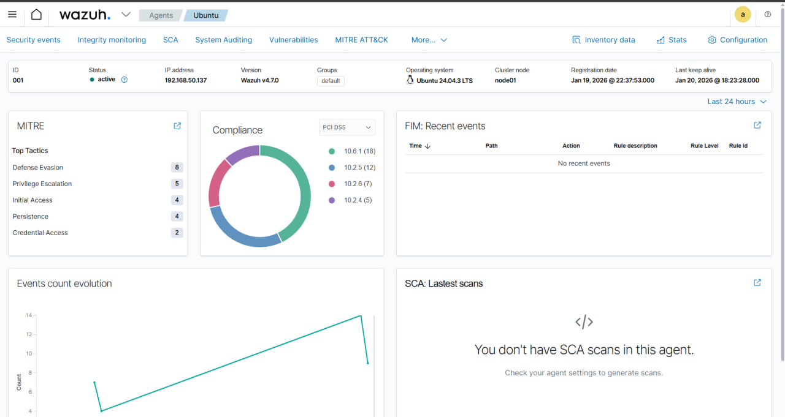
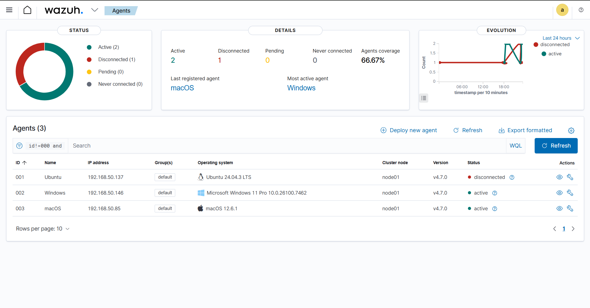

# Wazuh Agent – Linux (Ubuntu)

This document describes how to install and connect a Wazuh agent running on
a Linux host to a Wazuh Manager deployed in Docker.

## Environment

- Wazuh Manager: Docker on Windows host
- Manager IP: 192.168.50.181
- Agent OS: Ubuntu 24.04 LTS
- Agent IP: 192.168.50.137

## Network architecture

The Wazuh Manager runs inside a Docker container. Agents connect to the
Windows host IP where Docker exposes the required ports.

Required open ports on the manager host:
- TCP 1514 (agent events)
- TCP 1515 (agent registration)
- UDP 514  (syslog, optional)

## Installation

Download and install the agent package:

```bash
wget https://packages.wazuh.com/4.x/apt/pool/main/w/wazuh-agent/wazuh-agent_4.7.0-1_amd64.deb
sudo WAZUH_MANAGER='192.168.50.181' \
     WAZUH_AGENT_NAME='Ubuntu' \
     dpkg -i wazuh-agent_4.7.0-1_amd64.deb
```

Start the agent

```
sudo systemctl daemon-reload
sudo systemctl enable wazuh-agent
sudo systemctl start wazuh-agent
```

Verification

Check agent status:

```sudo systemctl status wazuh-agent ```

The agent should appear as Active in the Wazuh Dashboard:
Agents → Overview.


## Dashboard verification



## Agents overview


