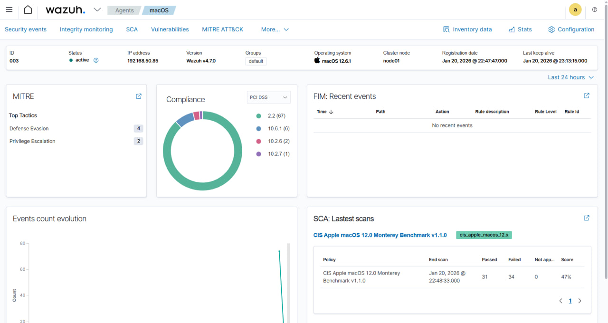

# Wazuh Agent – macOS (Virtual Machine)

This document describes how to install and connect a Wazuh agent running on
a macOS virtual machine to a Wazuh Manager deployed in Docker.

## Environment

- Wazuh Manager: Docker on Windows host
- Manager IP: 192.168.50.181
- Agent OS: macOS (Virtual Machine)
- Agent IP: 192.168.50.85
- Architecture: x86_64 (Intel)
- Wazuh version: 4.7.0

## Installation

The agent was installed using the official Wazuh macOS package with
environment variables for automatic configuration.

```bash
curl -so wazuh-agent.pkg https://packages.wazuh.com/4.x/macos/wazuh-agent-4.7.0-1.intel64.pkg

echo "WAZUH_MANAGER='192.168.50.181' && WAZUH_AGENT_NAME='macOS'" > /tmp/wazuh_envs

sudo installer -pkg ./wazuh-agent.pkg -target /
```

Start the agent

```sudo /Library/Ossec/bin/wazuh-control start```

Verification

```sudo /Library/Ossec/bin/wazuh-control status```

The agent appears as Active in the Wazuh Dashboard:
Agents → Overview.

## Notes

The agent was deployed on a macOS virtual machine. No additional Privacy &
Security permissions were required in this lab environment. Event collection
(authentication, process activity) works as expected.

## Dashboard verification


