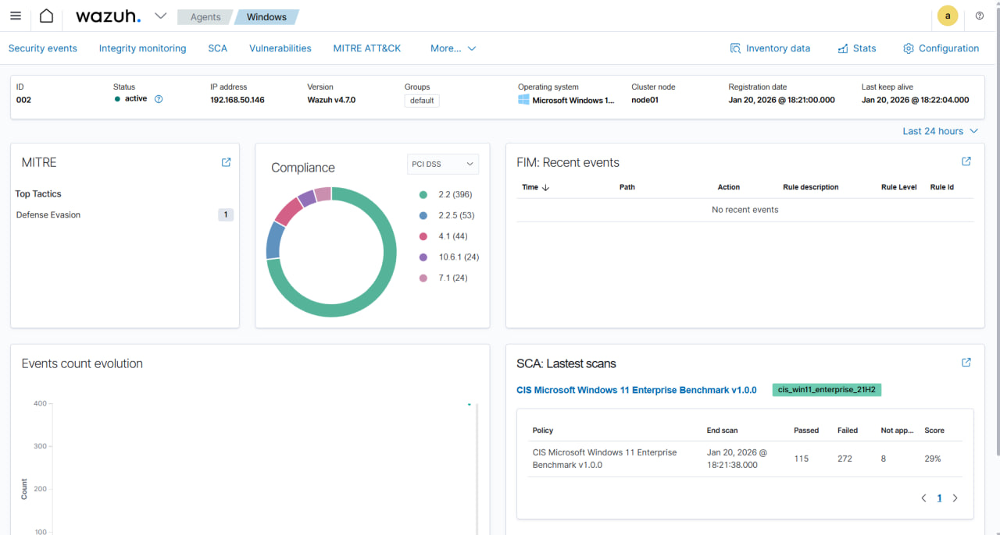

# Wazuh Agent – Windows

This document describes how to install and connect a Wazuh agent running on
a Windows host to a Wazuh Manager deployed in Docker.

## Environment

- Wazuh Manager: Docker on Windows host
- Manager IP: 192.168.50.181
- Agent OS: Windows
- Agent IP: 192.168.50.146
- Wazuh version: 4.7.0

## Network architecture

The Wazuh Manager runs inside a Docker container. The Windows agent connects
to the Windows host IP where Docker exposes the required ports.

Required open ports on the manager host:
- TCP 1514 (agent events)
- TCP 1515 (agent registration)

## Installation (PowerShell)

Run PowerShell as **Administrator**:

```powershell
Invoke-WebRequest -Uri https://packages.wazuh.com/4.x/windows/wazuh-agent-4.7.0-1.msi `
  -OutFile $env:TEMP\wazuh-agent.msi

msiexec.exe /i $env:TEMP\wazuh-agent.msi /q `
  WAZUH_MANAGER="192.168.50.181" `
  WAZUH_AGENT_NAME="Windows" `
  WAZUH_REGISTRATION_SERVER="192.168.50.181"
```

Start the agent service

```NET START WazuhSvc```

Verification
Check service status:

```Get-Service Wazuh*```

The agent should appear as Active in the Wazuh Dashboard:
Agents → Overview.

Windows Event Logs (Security, System, Application) are collected automatically.

## Dashboard verification


