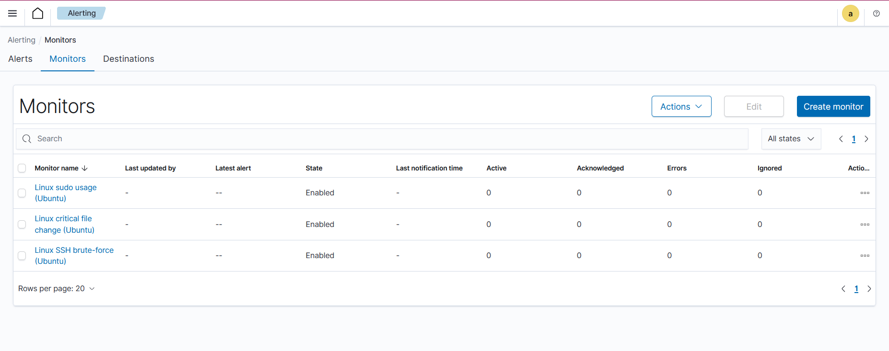

# Alerting and Notifications

## Overview

As part of this project, an alerting and notification mechanism was implemented using the Wazuh SIEM platform.

The goal of this stage is:
- to detect security-related events on Linux hosts,
- to correlate events in near real-time,
- to notify the security administrator via Slack.

Alerting is implemented using the **Per Query Monitor** functionality in the Wazuh Dashboard.
Notifications are delivered through **Slack Incoming Webhooks**.

## Environment

- SIEM platform: Wazuh 4.7.x
- Deployment: Docker (single-node)
- Agents:
  - Linux: Ubuntu 24.04.3 LTS
  - Windows: Windows 11 Pro
  - macOS: macOS 12.6.1
- Notification channel: Slack (Incoming Webhook)

## Implemented Linux alerts

The following alerts have been implemented for Linux agents:
1. SSH brute-force detection
2. Sudo usage monitoring
3. Critical system file integrity monitoring (Syscheck)

All monitors are executed every 1 minute.

