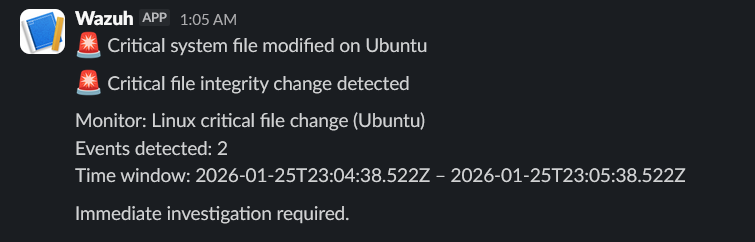
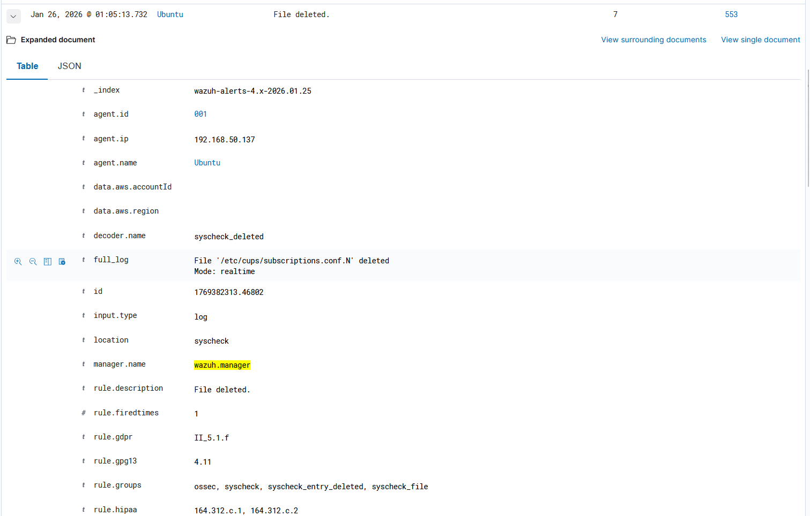

# Linux critical file integrity monitoring

## Description

This alert detects unauthorized or unexpected modifications of critical Linux system files.
The detection is based on the File Integrity Monitoring (Syscheck) module operating in real-time mode.

Monitored files:
- `/etc/passwd`
- `/etc/shadow`
- `/etc/sudoers`

## Syscheck configuration

To enable real-time detection of critical file modifications, the Syscheck module was reconfigured on the Linux agent.

The following configuration was applied on the Linux host:

**File:** `/var/ossec/etc/ossec.conf`

```xml
<syscheck>
  <disabled>no</disabled>

  <!-- Enable real-time monitoring -->
  <scan_on_start>yes</scan_on_start>

  <!-- Real-time monitoring for /etc directory -->
  <directories realtime="yes">/etc</directories>

  <!-- Explicit monitoring of critical system files -->
  <file realtime="yes">/etc/passwd</file>
  <file realtime="yes">/etc/shadow</file>
  <file realtime="yes">/etc/sudoers</file>

  <!-- Excluded files -->
  <ignore>/etc/mtab</ignore>
  <ignore>/etc/random-seed</ignore>
  <ignore>/etc/adjtime</ignore>

  <skip_nfs>yes</skip_nfs>
  <skip_dev>yes</skip_dev>
  <skip_proc>yes</skip_proc>
  <skip_sys>yes</skip_sys>
</syscheck>
```
After applying the configuration, the Wazuh agent was restarted:
```sudo systemctl restart wazuh-agent```
This configuration ensures that any modification of critical system files is detected immediately and reported to the Wazuh manager.

## Detection logic

Monitor type:
- Per query monitor (Visual editor)

Filters:
- `rule.groups` contains `syscheck`
- `rule.groups` contains `syscheck_entry_modified`
- `agent.name` is `Ubuntu`

The alert is triggered whenever a monitored file is modified.

## Severity

- Severity level: High

## Notification

A Slack notification is sent whenever a critical system file is modified.
Such events require immediate investigation as they may indicate system compromise.

## Verification

To verify the alert, the `/etc/sudoers` file was modified using the `visudo` utility.
The file integrity change was successfully detected by Syscheck and resulted in a Slack notification.




