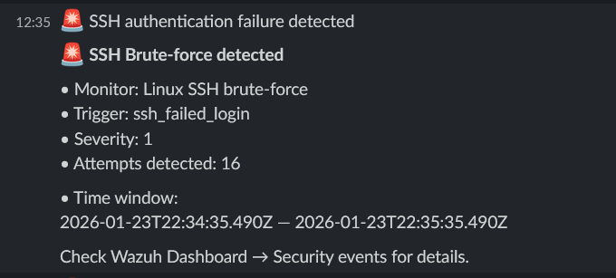

# Linux SSH brute-force detection

## Description

This alert is designed to detect SSH brute-force attacks against Linux hosts.
It identifies multiple failed authentication attempts within a short time window.

## Detection logic

Monitor type:
- Per query monitor (Visual editor)

Filters:
- `rule.groups` contains `authentication_failed`
- `rule.description` contains `ssh`
- `agent.name` is `Ubuntu`

Correlation parameters:
- Time window: 5 minutes
- Trigger condition: more than 5 failed authentication events

## Severity

- Severity level: High

## Notification

When the alert is triggered, a notification is sent to Slack indicating a potential SSH brute-force attack.

## Verification

To verify the alert, several failed SSH login attempts were performed using invalid credentials.
After exceeding the configured threshold, the alert was successfully triggered and delivered to Slack.

