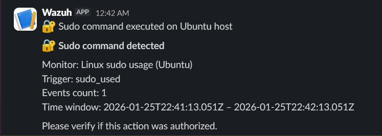

# Linux sudo usage monitoring

## Description

This alert monitors the usage of the `sudo` command on a Linux host.
Tracking privilege escalation events is critical for identifying potentially malicious or unauthorized actions.

## Detection logic

Monitor type:
- Per query monitor (Visual editor)

Filters:
- `rule.groups` contains `sudo`
- `agent.name` is `Ubuntu`

The alert is triggered for every sudo execution.

## Severity

- Severity level: Medium

## Notification

Each sudo execution generates a Slack notification, allowing security personnel to track privileged activity on the system.

## Verification

To validate the alert, a command was executed using `sudo` on the Linux host.
The event was correctly detected and a notification was sent to Slack.

