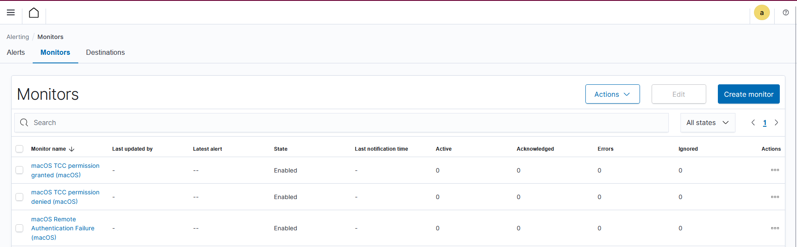

# macOS alerting

## Overview

This section describes security alerting use cases implemented for macOS hosts
using the Wazuh SIEM platform.

The alerts are based on native Wazuh macOS rules and focus on
user authentication, permission control, and remote access activity.

All alerts generate real-time Slack notifications to ensure
prompt incident awareness and response.

## Implemented alerts

The following macOS alerts have been implemented:

1. Application permission access (TCC framework)

Due to limitations of OpenSearch Alerting when combining multiple rule IDs
in a single query, separate alerts were implemented for each macOS security event.
This approach improves reliability, clarity, and operational response.

2. Screen sharing authentication attempts

## Agent information

- OS: macOS
- Agent name: `macOS`
- Wazuh rules file: `0960-macos_rules.xml`

