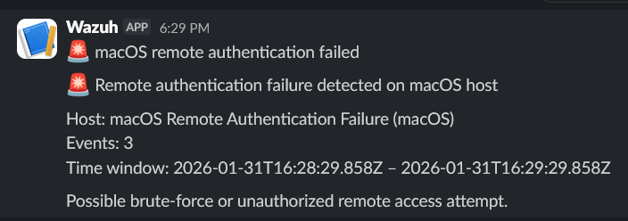

# macOS screen sharing authentication failure monitoring

## Description

This alert detects multiple failed authentication attempts related to macOS
Screen Sharing services.

Repeated authentication failures may indicate brute-force attempts,
password guessing, or unauthorized remote access activity.

## Detection logic

Monitor type:
- Per query monitor

Filters:
- `rule.id` is `89606`
- `agent.name` is `macOS`

Trigger condition:
- Number of events greater than 3 within the configured time window

This approach reduces false positives by ignoring isolated authentication failures
and focusing on repeated suspicious behavior.

## Severity

- Severity level: High

## Notification

A Slack notification is sent when multiple failed screen sharing authentication
attempts are detected on a macOS host.

## Verification

To verify the alert:
1. Attempt to connect to macOS Screen Sharing from another host
2. Perform more than three failed login attempts using invalid credentials
3. Observe the alert generated in Slack

## Screenshot

