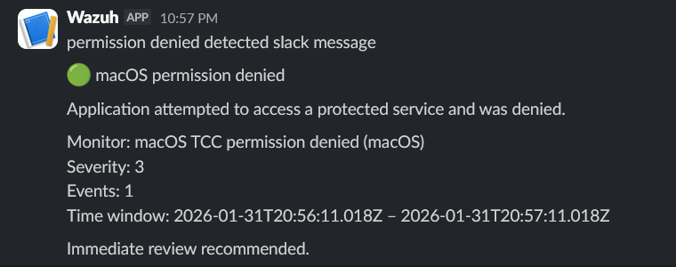

# macOS TCC permission denied

## Description

This alert detects cases where an application attempts to access
a protected macOS service but is denied by the Transparency,
Consent, and Control (TCC) framework.

Such events may indicate suspicious application behavior,
malware activity, or unauthorized access attempts.

## Detection logic

Monitor type:
- Per query monitor

Filters:
- `rule.id` is `89601`
- `agent.name` is `macOS`

Rule description example:
- Application has been denied permission to a protected service.

## Severity

- Severity level: Medium

## Notification

A Slack notification is sent whenever an application is denied
access to a protected system service.

## Verification

To verify the alert:
1. Open **System Settings → Privacy & Security**
2. Navigate to a protected category (e.g. Screen Recording)
3. Disable access for an application (e.g. Telegram)
4. Observe the alert generated in Slack

## Screenshot

