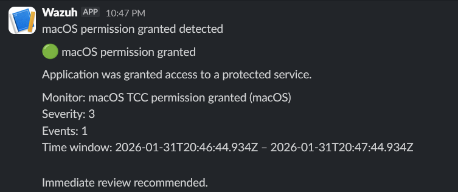

# macOS TCC permission granted

## Description

This alert detects when an application is granted access
to a protected macOS service through the TCC framework.

Although permission grants are expected in some cases,
they should be monitored to detect potentially risky behavior.

## Detection logic

Monitor type:
- Per query monitor

Filters:
- `rule.id` is `89600`
- `agent.name` is `macOS`

Rule description example:
- Application has been granted permission to a protected service.

## Severity

- Severity level: Medium

## Notification

A Slack notification is sent whenever an application
is granted access to a protected service.

## Verification

To verify the alert:
1. Open **System Settings → Privacy & Security**
2. Enable access for an application (e.g. Screen Recording)
3. Observe the alert generated in Slack

## Screenshot

