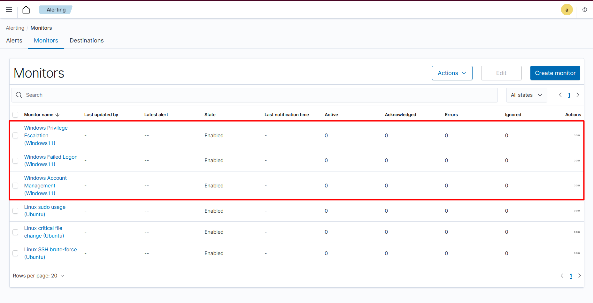
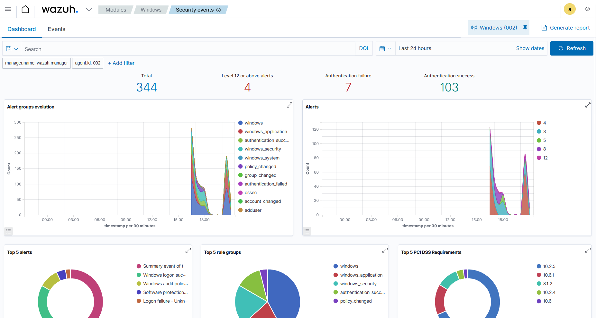

# Windows alerting

## Overview

This section describes security alerting use cases implemented for Windows hosts
using the Wazuh SIEM platform.

All alerts are based on Wazuh internal rule IDs and leverage default
Windows Security Event processing without custom decoders or rules.

## Implemented alerts

The following Windows alerts have been implemented:

1. Failed logon detection (brute-force / password spraying)
2. Privilege escalation detection (Administrators group membership changes)
3. User account management monitoring

## Notifications

All alerts generate real-time notifications delivered to Slack via
Incoming Webhooks, enabling rapid incident awareness and response.

