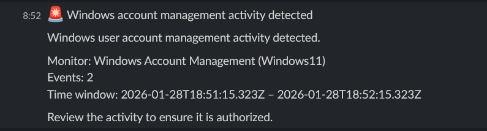

# Windows account management monitoring

## Description

This alert monitors Windows user account management activities,
including account creation, modification, enabling, disabling, and deletion.

Such actions are security-sensitive and may indicate persistence,
lateral movement, or administrative abuse.

## Detection logic

Monitor type:
- Per query monitor (Visual editor)

Filters:
- `rule.id` is `60109` (user account enabled or created)
- `rule.id` is `60110` (user account changed)
- `rule.id` is `60111` (user account disabled or deleted)
- `agent.name` is `Windows`

The alert is triggered whenever any account management activity is detected.

## Severity

- Severity level: Medium

## Notification

A Slack notification is sent for each detected account management event.
This allows security personnel to review user account changes in real time.

## Note on rule mapping

Windows account management events (Event IDs 4720, 4722, 4725, 4726)
are mapped by Wazuh to internal rule IDs.

Alerting logic is based on Wazuh rule IDs rather than the original
Windows Security Event IDs.

## Verification

To verify the alert, test user accounts were created, modified,
disabled, and deleted on the Windows host.

Each action was successfully detected and reported to Slack.

