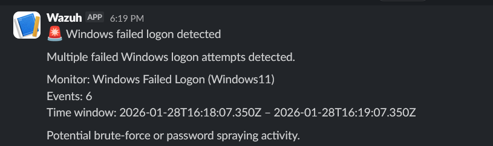

# Windows failed logon detection

## Description

This alert detects multiple failed authentication attempts on a Windows host.
Such activity may indicate brute-force attacks or password spraying attempts.

## Detection logic

Monitor type:
- Per query monitor (Visual editor)

Filters:
- `rule.id` is `60122`
- `agent.name` is `Windows`

Correlation parameters:
- Time window: 5 minutes
- Trigger condition: more than 5 events

## Severity

- Severity level: High

## Notification

When the alert is triggered, a notification is sent to Slack indicating
potential malicious authentication activity on the Windows host.

## Note on rule mapping

Although the original Windows Security Event ID for failed logon is **4625**,
Wazuh generates a corresponding internal alert using its own rule ID.

For Windows failed logon events, Wazuh maps Event ID **4625** to **rule.id = 60122**.

For this reason, the alerting logic is based on the Wazuh rule ID rather than
the original Windows event ID.

## Verification

To verify the alert, multiple failed logon attempts were performed on the
Windows host using invalid credentials.

After exceeding the configured threshold, the alert was successfully triggered
and a notification was delivered to Slack.

