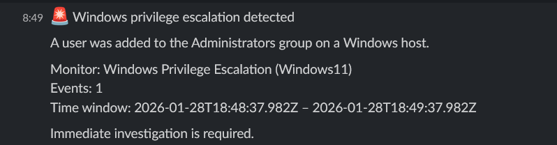

# Windows privilege escalation detection

## Description

This alert detects privilege escalation events on a Windows host,
specifically when a user is added to the local Administrators group.

Such activity represents a critical security event and may indicate
compromise or unauthorized administrative access.

## Detection logic

Monitor type:
- Per query monitor (Visual editor)

Filters:
- `rule.id` is `60154`
- `agent.name` is `Windows`

The alert is triggered immediately when a privilege escalation event is detected.

## Severity

- Severity level: High

## Notification

A Slack notification is sent whenever a user is added to the Administrators group.
Immediate investigation is required to confirm whether the action was authorized.

## Note on rule mapping

Windows security events related to privilege escalation (Event IDs 4728 and 4732)
are mapped by Wazuh to internal rule IDs.

Alerting logic is therefore based on the corresponding Wazuh rule IDs rather than
the original Windows Security Event IDs.

## Verification

To verify the alert, a test user was added to the local Administrators group
on the Windows host.

The privilege escalation event was successfully detected and a notification
was sent to Slack.

